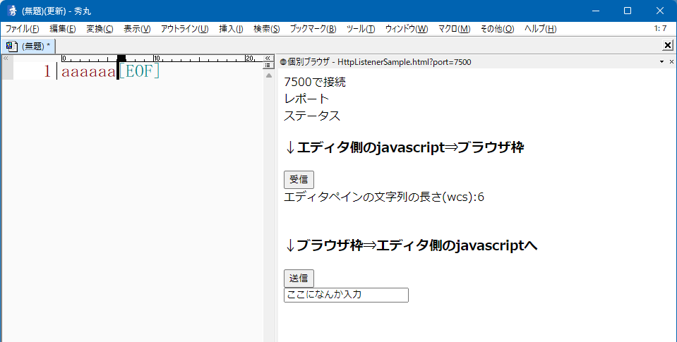

# localhost:空きポート での<br>シンプルなHttpListnerを建てる関数を用意してはどうでしょうか。

v9.22 である必要はないですが、v9.23以降どんどん非同期関数が増えてくるのであれば、  
メリットが大きくなってきます。

# それ作るとどんな感じになるの？
- ちょっと具体的に動作するサンプルを hmV8 を絡めて作ってみました。  
秀丸にHttpListener案を取り入れるしたとしたら、「JavaScript」と「ネイティブ」の境界線が似た感じになるhmV8で作ると  
イメージが掴みやすいかと思ったからです。  



# 場所
  - https://github.com/komiyamma/hm_http_listener_sample/releases の HttpListenerSample.zip
    - ダウンロードした後、zipのブロック解除(or 許可する)を忘れないで!!
  - 実行には hmV8 が必要です。https://xn--pckzexbx21r8q9b.net/?page=nobu_tool_hm_ecmascript
    - ダウンロードした後、zipのブロック解除(or 許可する)を忘れないで!!

# HttpListner概要
- HttpListnerを建てる関数を用意する。
該当の関数は、概ね
```
  let port = hidemaru.createHttpListner( onPostRequestFunc, onTextRequestFunc, portMin );
```
といったようなイメージ。

# このリスナーを作ることでどのようなメリットがあるの？
- このリスナーを作ることで、秀丸と「個別ブラウザ」「共有ブラウザ」「レンダリング枠」「外部ブラウザ」「外部Webコンポーネントを使ったアプリ」と
非常に簡単に通信できるようになります。

- その記述方法は特定のWebコンポーネントに依存しません。ユーザーが作成する記述がWebViewコンポーネントに大きく依存する
といったことはありません。  
それらは全く同じスクリプト記述となります。


# サンプルの挙動
  - HttpListenerSample.zip を ブロック解除した後、解凍すると、
    (.mac、 .dll、.html) が出てきますので、それをどこぞにまとめて移動  
  - 新規ファイルを作成して、適当に文字列を入力
  - HttpListenerSample.mac を実行

# 中身を見ていく

# HttpListenerSample.mac

## HttpListener まわりでユーザーが実際に記述する部分のイメージは？

ユーザーがHttpListenerで 実際に jsmode で記述するイメージは

```
// このプロセスで初実行。JSエンジンが生存している間、有効な変数にしているだめ。
if (typeof(listner) === "undefined") {
    var listner = null;
    var port = null;
    var count = 0;
} else {
    // 再実行した際に前回分を破棄しているだけ。
    listner.Close();
    port = 0;
    count = 0;
}

// 本題。
// 
// リスナーにPOSTが来た際に呼び出してもらう関数用。
// 要するにブラウザ枠やブラウザから、javascriptエンジンへとデータを伝達するためのもの。
// POSTで渡ってきた値(テキスト)がそのまま関数にわたってくる。
// 返り値を設定すれば、それがPOSTに対するステータスになる。(なんか大失敗している時は、ステータスにそれをわかる数値をかえせばよい)
function onPostRequestFunc(text) {
    op_print("通信相手からこの(プロセス空間 & スクリプトエンジン空間)に受信しました\r\n");
    op_print("受け取ったテキストは「" +  text + "」\r\n");
    // hmV8は「同期用」なので、非同期の「マクロ関数」を持っていないので、これ以上秀丸機能の引き出すことはあまりできないが、
    // jsmode で同様のものを実装すれば、将来非同期で道具が増えてくるので、いろいろできるだろう。

    let json = JSON.parse(text);
    op_print("JSONとして解釈。key1:" + json.key1 + "\r\n");
    op_print("JSONとして解釈。key2:" + json.key2 + "\r\n");

    return 201;
}

// テキストを要求する関数。POST意外は基本これを渡す。
// ようするに、javascriptエンジンから、ブラウザ枠へと値を伝達するためのもの。
function onTextRequestFunc(param) {
    if (param) {
        op_print("param に「" + decodeURI(param) + "」が渡ってきました\r\n");
    }
    return "エディタペインの文字列の長さ(wcs):" + hm.Edit.TotalText.length + "\r\n";
}

// 本題。 httpListnerの生成。JavaScriptから、
// ・POSTを受け取った時に処理する関数
// ・普通のリクエスト受け取った時に表示するテキスト内容を返す関数を渡す。
listner = createHttpListner(onPostRequestFunc, onTextRequestFunc);

// 上の引数に含めてしまった方がよいがここが１つか２つかは本題とは無関係
// portを指定するが埋まっていることも多いので、「最小port」と「最大port」を指定する。
// その指定範囲で空いてるポートが見つからなければ、0が返る。
port = listner.Start(7500, 20000);

```

# createHttpListner まわり
createHttpListner に対して、

   - POST処理が来た時用の関数と、
   - 普通にGETが来た時ようの関数
   - このポート番号で繋げたいという番号

などを渡してもらい、実際に接続したポートを返す。

## onPostRequestFunc

```
function onPostRequestFunc(text: string): number | undefined
```

HttpListnerにPOST要求が来た時、この関数が呼ばれる。
textにはPOSTで送られてきたもの(がテキストであるという前提で)、渡される。
返り値は「ステータス番号」、何も返さなければ原則200となる。

## onTextRequestFunc

```
function onTextRequestFunc(param: string): string
```

HttpListnerにPOST意外の要求(まぁ普通のGETリクエスト想定)が来た時、この関数が呼ばれる。
普通に何らかの文字列を返す。
param に 何かステータスを伝えるためのシンボル的なものを渡すことで、
返す文字列を切り替えるといった目的に使える。


## 以上の部分が今回の中核

以上の部分が今回の中核です。これと近い記述がjsmodeで出来ればいいんじゃないかというところです。
パラメータやcallback用の関数の渡し方は、hideamru.runProcessあたりと似た感じにすればよいのではないでしょうか。


# 他も見ていく。

# HttpListenerSample.mac の続きは実際の使い方の例になっています。

```
    // ブラウザ枠表示
    browserpanecommand(
        {
            target: target_browser,
            url: target_html_file + `?port=${port}`,
            show: 1,
            size: target_browser_size
        }
    );
```

ポートの番号はこのサンプルのように get パラメータとして伝達するのが楽か
直後のコメントアウトのように

```
    // ポート番号の伝達
    browserpanecommand(
        {
            target: target_browser,
            url: `javascript:initPort(${port})`,
            size: target_browser_size
        }
    );

```

のように伝えても良いが、この場合は、「更新」するとportをロストしやすいので
sessionStrage に記憶する必要が出てしまう。
(原則的にはport番号をgetのパラメータとしてURLに埋め込んでしまった方が、更新でも消えることが無くなるので楽)

# HttpListenerSample.html

## 接続ポートを拾う

```
window.onload = function(....
```

で接続ポートを拾っている。URLに埋め込んでる、と決め打てば後半だけになり、短くなる。

## updateFetch(...)

javascriptで設定した、「onTextRequestFunc」を呼び出すためのもの。


## postToServer(...)

javascriptで設定した、「onPostRequestFunc」を呼び出すためのもの。


# HttpListener の中身
( 今回はソースが分かりやすいのでC#での実装だが、これは秀丸ではネイティブ実装+薄いjavascriptラッパー )

- https://github.com/komiyamma/hm_http_listener_sample/blob/main/HttpListenerSample/Program.cs

## GetAvailablePort

- 指定された最小Port番号以上、最大Port番号までで「空いている」ポートを返す。  
ユーザー使いたいと思っているポート番号が実際に利用可能とは限らないので、  
このような処理が必要。  
使用可能なポート番号を返し、ユーザーは「自分が使いたい番号」ではなく、「返ってきた番号」を使う必要がある。
なお、最大ポートを指定させる意味はないかも。

## 異なるポートや異なるプロトコルからアクセスされるとわかっているので、

- HttpListenerContext context = listener.GetContext();

```
  context.Response.Headers.Add("Access-Control-Allow-Origin", "*");
```
ここが懸念点であろうから、接続元(fetchやXMLHttpRequest().sendなどを発行する側)となるURLを file:/// か http://localhost or http://127.0.0.1 に
縛っても良いかもしれない。

あるいは、そういったフィルターはユーザーにまかせても良いかもしれない。

## POSTリクエスト

```
if (request.HttpMethod == "POST") {
    ...
    int status = 200;
    using (StreamReader reader = new StreamReader(request.InputStream, Encoding.UTF8))
    {
        // リクエストボディから文字列を読み取る
        string text = reader.ReadToEnd();

        try { 
            // 整数がJS関数から返ってきていたら、それを代入する
            Object temp_status = onPostRequestFunc(text);}

    ...
```

今回は「文字列意外扱えても微妙だし、文字列だけでいいでしょ」とした。

## それ意外のリクエスト

```
    string hm_param = "";
    // GETパラメータを処理する

    ... (今回は "param=****" という"param"というクエリーキーがあれば、その値を onTextRequestFunc に渡すようにしたが、クエリパラメータ全体をjsonオブジェクト形式にしてhm_param として渡しても良いかも


    // HTMLを表示する
    if (request != null)
    {
        string hmtext = this.onTextRequestFunc(hm_param);
        byte[] text = Encoding.UTF8.GetBytes(hmtext);
        response.ContentType = "text/plain; charset=utf-8";

